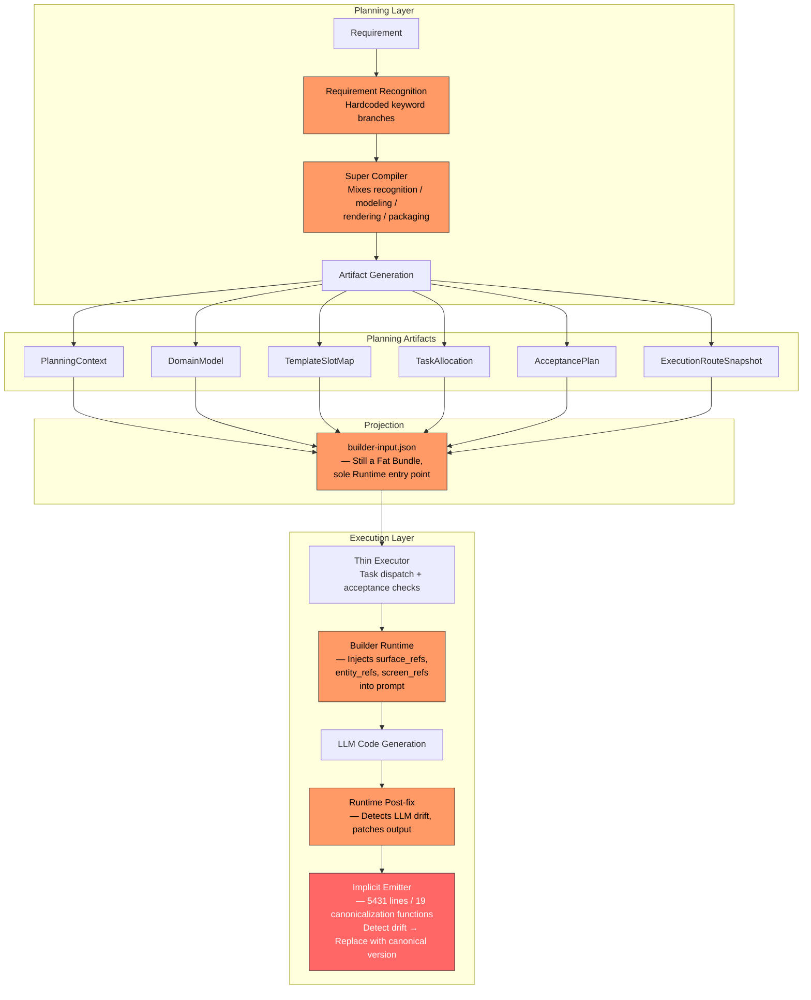
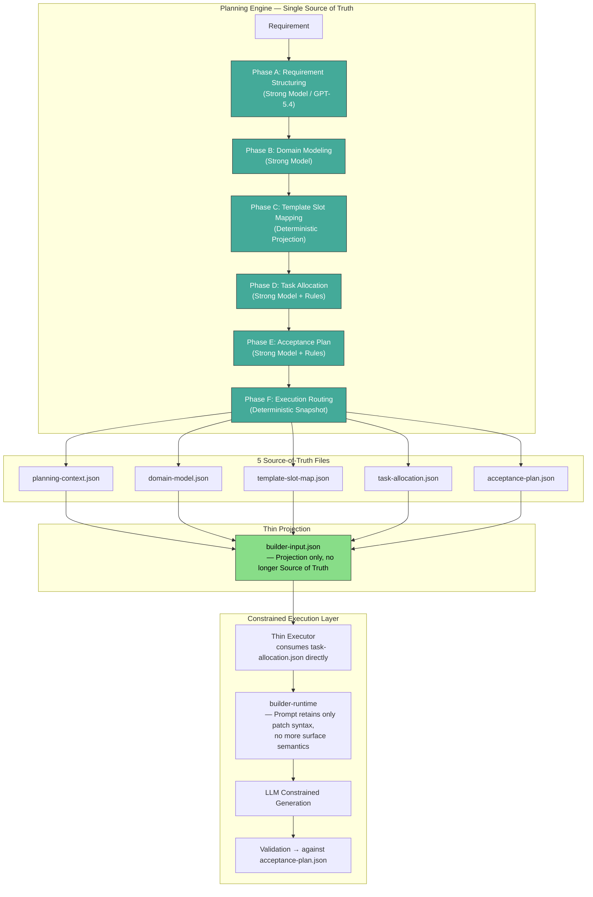
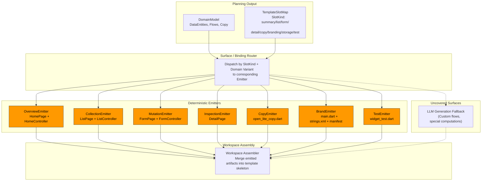
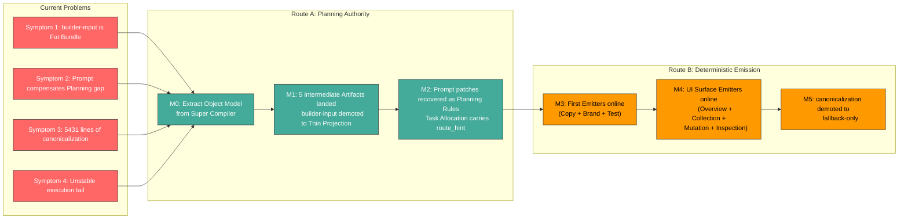

# PicoClaw AppFactory 架构演进方案：从 Runtime Compensation 到 Deterministic Emission

> 状态：Active
>
> Route B 迁移状态：relation-rich canonical 主路径已达终局，generic open-lite 通用化仍未完成。M6.3 完成后，Deterministic Emitter 已覆盖 relation-rich canonical 模板的 UI 表面；generic 主线当前仍保留 fallback、targeted repair 与 runtime private normalize/canonicalize 负担，后续以 `appfactory-architecture-evolution-todo.zh.md` 的 capability / binding / surface / policy 收口计划为准。
>
> 本文档是 AppFactory 规划层与执行层边界的主设计文档，涵盖当前架构诊断、目标对象模型、分解流水线、模型分层策略和完整演进路线（M0-M6）。
> 原 `appfactory-planning-engine.zh.md` 和 `appfactory-planning-engine-todo.zh.md` 的有效内容已合并至本文档，旧文档已移除。

## 0. 文档在设计体系中的位置

| 文档 | 关注层 | 状态 |
|---|---|---|
| `demand-to-android-app-platform.zh.md` | 产品边界、模块职责、总体路线 | Frozen |
| **本文档** | **规划层对象模型、分解流水线、执行边界演进** | **Active** |
| `appfactory-architecture-evolution-todo.zh.md` | 细化实施任务与执行清单 | Active |
| `appfactory-generic-policy-contract.zh.md` | generic binding-surface 语义表、repair taxonomy、policy registry 契约 | Active |
| `demand-to-android-app-platform-interfaces.zh.md` | 公共 API、内部接口、Schema | Frozen |

当前补充约束如下：

- `weight-tracker` 只作为 generic fixture，用来证明 generic `/jobs` 主链可跑；它不再反向定义公共修复语义。
- bookkeeping 与 relation-rich completed 样本只保留为防回退护栏，不再覆盖 generic 主结论。
- 后续新增公共规则不得再以单个 live 文件名、单个实体名或单一样本拓扑命名。
- generic binding-surface 语义表、repair taxonomy 和 policy registry 契约统一以下一份 active 文档为准：`appfactory-generic-policy-contract.zh.md`。

### 当前执行约束（2026-04-25）

- generic open-lite 的 P5 进入“先规划冻结、再按波次迁移”的执行阶段；默认不再继续以发现一个 helper 漏口就追加一刀的方式推进主线。
- 在继续迁移 runtime consumer 之前，必须先冻结四类执行输入：template-private `surface -> class/path` registry 合同、consumer 迁移矩阵、验收矩阵，以及每一波迁移的停止条件。
- P5 未完成上述冻结前，允许的代码改动只应服务于当前波次的已批准范围；不再接受与当前波次无关的症状级 generic helper 修补进入主线。
- P6 的 deterministic emitter 扩展继续以后续 todo 为准，但默认受阻于 P5 的合同冻结与 consumer 收口；避免 emitter 和 runtime registry 在 path/class 推断上再次长出两套语义。

## 1. 问题陈述

当前架构的**上半身**（控制平面、规划制品）和**下半身**（运行时执行边界）之间存在未完成的权责切割。

具体来说：

- planning-engine 已经产出了结构化中间制品（PlanningContext、DomainModel、TemplateSlotMap、TaskAllocation、AcceptancePlan）。
- 但 `builder-input.json` 仍然是一个"胖包"，runtime 的主消费入口是它而不是上游制品。
- builder-runtime prompt 仍在代偿规划缺口，主动教模型关于表面语义、协同规则和文案策略。
- `builder_runtime_open_lite_private.go`（5431 行、19 个 canonicalization 函数）已膨胀为一个**部署在错误位置的 Implicit Emitter**。

这意味着系统付出了 LLM 推理时间和 token 成本去生成代码，然后又检测出代码偏离已知正确形态，用预置的规范版本替换掉。这在工程和经济上都不可持续。

## 2. 当前架构现状

### 2.1 架构图

### 2.2 问题节点说明

| 节点 | 问题 |
|---|---|
| `analyzeRequirement()` | 领域识别靠 Go 硬编码关键词分支，不可治理 |
| `Compile()` | 超级编译器，mixing 识别/建模/打包/渲染 |
| `builder-input.json` | 胖包，仍是 runtime 唯一真相源 |
| runtime prompt | 代偿规划缺口，主动教模型表面语义和协同规则 |
| `normalizeBuilderRuntimeViewContent()` | 后置修复层，检测 LLM 输出偏离后 patch |
| `builder_runtime_open_lite_private.go` | 5431 行 Implicit Emitter，19 个函数覆盖所有主要 UI 表面 |

### 2.3 canonicalization 函数清单（Implicit Emitter 证据）

以下 19 个函数覆盖了 flutter-open-lite 模板的所有主要 UI 表面：

| # | 函数名 | 覆盖表面 | 域变体 |
|---|---|---|---|
| 1 | `...CanonicalizeRepositoryFormController` | FormController | 通用 |
| 2 | `...CanonicalizeRelationRichFormPage` | FormPage | RelationRich |
| 3 | `...CanonicalizeInventoryRelationRichFormPage` | FormPage | Inventory |
| 4 | `...CanonicalizeRelationRichCopy` | CopyHelper | RelationRich |
| 5 | `...CanonicalizeInventoryRelationRichCopy` | CopyHelper | Inventory |
| 6 | `...CanonicalizeRelationRichHomeController` | HomeController | RelationRich |
| 7 | `...CanonicalizeRelationRichListController` | ListController | RelationRich |
| 8 | `...CanonicalizeRelationRichFormController` | FormController | RelationRich |
| 9 | `...CanonicalizeRelationRichListPage` | ListPage | RelationRich |
| 10 | `...CanonicalizeInventoryRelationRichListPage` | ListPage | Inventory |
| 11 | `...CanonicalizeRelationRichHomePage` | HomePage | RelationRich |
| 12 | `...CanonicalizeInventoryRelationRichHomePage` | HomePage | Inventory |
| 13 | `...CanonicalizeRelationRichDetailPage` | DetailPage | RelationRich |
| 14 | `...CanonicalizeInventoryRelationRichDetailPage` | DetailPage | Inventory |
| 15 | `...CanonicalizeRepositoryFormPage` | FormPage | 通用 |
| 16 | `...CanonicalizeRelationRichMain` | main.dart | RelationRich |
| 17 | `...CanonicalizeInventoryRelationRichMain` | main.dart | Inventory |
| 18 | `...CanonicalizeRelationRichWidgetTest` | WidgetTest | RelationRich |
| 19 | `...CanonicalizeInventoryRelationRichWidgetTest` | WidgetTest | Inventory |

每个函数的逻辑都是：**判断 LLM 输出是否偏离已知正确形态 → 如果偏离则替换为预置的规范版本**。

这本质上就是一个 Emitter——系统已经知道每种表面的正确输出应该是什么。只是它以 post-hoc patch 的形式存在，而不是以 pre-generation emit 的形式存在。

## 3. 两条演进路线

### 3.1 Route A：Planning Layer 权责归位（Prepare as Single Source of Truth）

**核心思想**：让 Planning Engine 产出的 5 个 Intermediate Artifacts 成为 Single Source of Truth，`builder-input.json` 降级为 Thin Projection，Runtime 不再越权做规划决策。

**解决的问题**：
- runtime prompt 不再代偿规划缺口
- 任务消费从 `BuildInput.TaskBundle` 迁移到 `task-allocation.json`
- `builder-input.json` 从胖包降级为可重建的投影

**未解决的问题**：
- 无论规划多完美，LLM 生成的代码仍有随机性
- 那 5431 行 canonicalization 代码一行都删不掉

### 3.2 Route B：Deterministic Emitter

**核心思想**：对已知模式的表面，直接从 Planning Artifacts 参数化 emit 正确代码，不经过 LLM。

#### Route B 架构图详解

上图是 Route B 的目标状态架构，从上到下分为四层：

**Planning Output（规划输出层）**

Emitter 的输入来自 Planning Engine 产出的两个核心制品：`DomainModel` 提供领域语义（实体、字段、流程、文案），`TemplateSlotMap` 提供模板覆盖点声明（每个 slot 的类型、绑定 ID、目标文件路径和 override policy）。这两个制品在 Route A 阶段落地为 JSON 文件，是 Emitter 的 Input Contract。

**Surface / Binding Router（路由层）**

Router 读取 `TemplateSlotMap` 中每个 slot 的 `SlotKind`（summary / list / form / detail / copy / branding / storage / test）和 Domain Variant（RelationRich / Inventory / Generic），将其分发到对应的 Emitter。同时，Router 依据 slot 的 `override_policy` 判断该表面走 emit 还是 LLM fallback。

**Deterministic Emitters（确定性代码生成层）**

七个 Emitter 各负责一类 UI 表面：

| Emitter | 职责 | 产出文件 |
|---|---|---|
| OverviewEmitter | 主页导航入口、摘要指标 | HomePage + HomeController |
| CollectionEmitter | 列表展示、筛选排序 | ListPage + ListController |
| MutationEmitter | 表单录入、字段校验 | FormPage + FormController |
| InspectionEmitter | 详情展示、字段只读渲染 | DetailPage |
| CopyEmitter | 文案 helper（标题、摘要） | open_lite_copy.dart |
| BrandEmitter | 应用名、启动器名、Android 资源 | main.dart + strings.xml + AndroidManifest.xml |
| TestEmitter | Widget 测试骨架 | widget_test.dart |

每个 Emitter 接收 `DomainModel` + `TemplateSlotMap` 的对应切片作为输入，通过参数化模板直接输出合法的 Dart / XML 文件。输出是 deterministic 的——给定相同输入，永远产出完全相同的代码，不存在 LLM 的随机性。

**Workspace Assembly（工作区组装层）**

Workspace Assembler 将所有 Emitter 的产出文件合并到模板骨架中，形成完整的 Flutter 工程。对于 Emitter 尚未覆盖的表面（自定义业务流程、特殊计算逻辑等），仍走 LLM Generation Fallback 路径，其产出同样汇入 Assembler。

**关键设计约束**：

- Emitter 只消费 Planning Artifacts，不读取 builder-input.json，不调用 LLM
- 每个 Emitter 的输出必须独立通过 `flutter analyze`，不依赖其他 Emitter 的产出
- Fallback 路径与 Emit 路径的产出格式一致，Assembler 无需区分来源

**优势对比**：

| 维度 | Route A（LLM + 完美规划） | Route B（Deterministic Emission） |
|---|---|---|
| 速度 | 每个表面需 LLM 推理（秒级） | 即时生成（毫秒级） |
| Token 成本 | 每个表面消耗 token | 零 token 成本 |
| 可靠性 | ~95%（LLM 仍有随机性） | 100%（确定性代码） |
| 可测性 | 需要回归测试套件 | 单元测试即可 |
| 可维护性 | prompt 工程 + canonicalization | Go 代码（IDE 支持、类型安全） |
| canonicalization 代码 | 仍然需要（兜底） | 大部分可删除 |

## 4. 结论：以 Emitter 为终点，反向设计 Planning Layer

### 4.1 核心判断

**Route B 是长期终局架构。Route A 是它的必要地基。两者不是二选一，而是同一条路的两个阶段。**

但关键在于：**不应该把 Route A 当作独立方案来投入**。

原因：

1. 如果只做 Route A，那 5431 行 canonicalization 代码一行都删不掉——它只是从“Runtime 越权补偿”变成了“Runtime 在完美规划下依然需要的修复层”。
2. 系统已经在自发向 Route B 演化——那 19 个 canonicalization 函数就是“部署在错误位置的 Emitter”。
3. `domainSpec` 已经包含 50+ 字段（DataEntities、SurfaceList、UserFlows、AcceptanceCriteria 等），配合 `TemplateSlotMap` 的 SlotKind，完全可以参数化 emit 所有已被 canonicalization 覆盖的表面。

### 4.2 为什么不能跳过 Route A 直接做 Route B

1. **Emitter 需要消费结构化的 Planning Output**——当前 thin_executor 主要从 `BuildInput.TaskBundle` 工作，不直接消费 `TemplateSlotMap` 和 `DomainModel`。Route A 完成后，这些制品才有稳定的消费接口。
2. **不是所有表面都能 emit**——19 个 canonicalization 函数覆盖了大部分 UI 表面，但真正的业务逻辑（自定义流程、特殊计算规则）仍需 LLM。Planning Layer 必须清晰标注哪些表面走 emit、哪些走 LLM generate。
3. **渐进迁移需要两层共存**——过渡期内，已有 Emitter 的表面走 emit，尚未覆盖的仍走 LLM + canonicalization。没有清晰的规划边界，两层会互相打架。

### 4.3 正确的实施策略

> **从一开始就以 Route B 为目标来设计 Route A 的接口。**

具体要求：

- Route A 的 `TemplateSlotMap` 设计时就要考虑它是 Emitter 的 Input Contract
- Route A 的 `DomainModel` 设计时就要包含 Emitter 参数化所需的所有字段
- Route A 的 Task Allocation 应包含 `route_hint: emit | generate` 的区分，明确哪些表面走 Deterministic Emission、哪些走 LLM Generation

这样 Route A 完成的那一天，第一个 Emitter 就可以立即上线，而不需要再做一轮重构。

### 4.4 综合架构图：迁移路径

## 5. 分阶段实施路线

### 5.1 M0：对象模型从 compiler.go 拆出

**目标**：让 planning-engine 拥有独立模块边界。

**退出条件**：
- `PlanningContext`、`DomainModel`、`TemplateSlotMap`、`TaskAllocationUnit`、`AcceptancePlan` 有正式 Go 类型
- `compiler.go` 不再同时承载识别 / 建模 / 渲染 / 打包

**对 Route B 的预埋**：
- `TemplateSlotMap` 的 SlotKind 枚举同时覆盖 Emitter 类型
- `DomainModel` 的字段集合足以驱动已有 canonicalization 函数的参数化

### 5.2 M1：5 个 Intermediate Artifacts 落地，builder-input 降级

**目标**：runtime 从消费胖 builder-input 迁移到消费结构化中间制品。

**退出条件**：
- `planning-context.json`、`domain-model.json`、`template-slot-map.json`、`task-allocation.json`、`acceptance-plan.json` 物理存在于 `jobs/{job_id}/prepare/`
- `builder-input.json` 可从上述 5 个文件重建
- thin_executor 直接消费 `task-allocation.json` 而非 `BuildInput.TaskBundle`

**对 Route B 的预埋**：
- `task-allocation.json` 中每个 allocation unit 携带 `route_hint`（emit / generate / deterministic）

### 5.3 M2：Prompt 补丁回收为 Planning Rules

**目标**：builder-runtime prompt 不再硬编码任何产品级覆盖点规则。

**退出条件**：
- surface_refs、entity_refs、semantic_intent_refs、screen_refs 不再注入 runtime prompt
- 多文件同步、文案同步、Android branding 同步规则迁入 `task-allocation.json` 的依赖关系
- runtime prompt 只保留 patch 语法约束和运行时安全规则

**对 Route B 的预埋**：
- 每个被回收的 prompt 规则都有对应的 allocation unit 或 slot 声明
- slot 声明包含 `emit_eligible: true/false`

### 5.4 M3：首批 Deterministic Emitter 上线

**目标**：最安全、最确定的三个表面率先脱离 LLM 生成。

**首批 Emitter**：

| Emitter | 覆盖文件 | 输入源 | 替代的 canonicalization 函数 |
|---|---|---|---|
| CopyEmitter | `lib/template/open_lite_copy.dart` | DomainModel.DomainCopy | #4, #5 |
| BrandEmitter | `lib/main.dart` + `android/.../strings.xml` + `AndroidManifest.xml` | DomainModel.DomainCopy + PlanningContext | #16, #17 |
| TestEmitter | `test/widget_test.dart` | TaskAllocation（所有 test 类 unit） | #18, #19 |

**退出条件**：
- 三个 Emitter 的输出通过 `flutter analyze` 和 `flutter test`
- 对应的 canonicalization 函数降级为 fallback-only（仅在 emit 失败时触发）

### 5.5 M4：UI Surface Emitter 上线

**目标**：主要 UI 表面脱离 LLM 生成。

**Emitter 映射**：

| Emitter | 覆盖文件 | 替代的 canonicalization 函数 |
|---|---|---|
| OverviewEmitter | HomePage + HomeController | #6, #11, #12 |
| CollectionEmitter | ListPage + ListController | #7, #9, #10 |
| MutationEmitter | FormPage + FormController + RepositoryFormController + RepositoryFormPage | #1, #2, #3, #8, #15 |
| InspectionEmitter | DetailPage | #13, #14 |

**退出条件**：
- 所有 UI Emitter 的输出通过全链验证（analyze + test + build）
- 对应的 canonicalization 函数降级为 fallback-only

### 5.6 M5：canonicalization 降级为 fallback-only 兜底层

**目标**：`builder_runtime_open_lite_private.go` 从主路径退出，只在 emit 失败或 LLM fallback 路径中生效。

**退出条件**：
- 默认执行路径不经过任何 canonicalization 函数
- canonicalization 仅在以下条件触发：(1) 新域变体尚无 Emitter，(2) Emitter 产出校验失败后 fallback，(3) 手动禁用 Emitter 时的降级路径
- `builder_runtime_open_lite_private.go` 可标记为 deprecated

## 6. Emitter Input Contract 要求

为使 Route A 的制品设计直接服务 Route B，Planning Layer 制品必须满足以下最低要求：

### 6.1 DomainModel 必须包含

| 字段组 | 用途 | 消费方 |
|---|---|---|
| `DataEntities[]` + 每个实体的 `Fields[]` | 驱动 FormPage、DetailPage 的字段列表 | MutationEmitter, InspectionEmitter |
| `DataEntities[].source` (input / derived) | 区分用户输入字段和计算字段 | MutationEmitter |
| `CriticalFlows[]` | 驱动 HomePage 导航入口 | OverviewEmitter |
| `DomainCopy` (Title, Summary, ProblemStatement) | 驱动 copy helper 和 branding | CopyEmitter, BrandEmitter |
| `SemanticAcceptanceRules[]` | 驱动验收证据匹配 | TestEmitter |

### 6.2 TemplateSlotMap 必须包含

| 字段 | 用途 | 消费方 |
|---|---|---|
| `SlotKind` (summary/list/form/detail/copy/branding/storage/test) | 路由到对应 Emitter | Router |
| `BindingID` | 绑定域变体（RelationRich / Inventory / Generic） | Emitter 参数化 |
| `PathClasses[]` | 对齐 policy registry 的路径类别，并作为 registry 投影的公共输入 | Router, validation |
| `TargetPaths[]` | Emitter 产出文件路径 | Workspace Assembler |
| `OverridePolicy` (emit / generate / manual) | 决定走 Emitter 还是 LLM | Router |
| `RegistryProjectionHints[]` | 把公共 binding / surface 投影到 template-private `template_role` | template-private registry |

### 6.3 TaskAllocation 必须包含

| 字段 | 用途 | 消费方 |
|---|---|---|
| `RouteHint` (emit / generate / deterministic) | 执行路由选择 | thin_executor |
| `Wave` | 依赖排序层级 | Workspace Assembler |
| `BindingRefs[]` / `SurfaceRefs[]` | 关联 TemplateSlotMap | Router |

### 6.4 Template-Private `surface -> class/path` Registry 必须包含

这个 registry 不是新的公共 Source of Truth，而是由 `TemplateSlotMap + template scan + workspace candidate detection` 确定性投影出来的 template-private 派生表，用于让 canonical controller/view 生成、fallback-only normalize、widget test canonical 输出和启发式评分共用同一份 concrete path/class 描述。

| 字段 | 说明 | 消费方 |
|---|---|---|
| `RegistryKey` | `binding_id + surface_ref + path_class + template_role` 组成的稳定派生键 | template-private helpers |
| `BindingID` / `SurfaceRef` | 对应公共 binding / surface | Router, repair policy |
| `PathClass` | `app_entry` / `view` / `controller` / `template_copy` / `widget_test` 等 | normalize, emit_runner |
| `TemplateRole` | `overview_view`、`collection_controller`、`mutation_view`、`inspection_view` 等模板私有角色 | template-private helpers |
| `ResolvedPath` | 当前模板或 workspace 中应被消费的具体文件路径 | canonical factory, normalize |
| `ResolvedClassName` | 当前路径承载的具体类名 | canonical factory, scoring |
| `ConstructorContract` | 该类的 required params、callback params、repository / controller / record 参数描述 | main wiring, canonical output |
| `CapabilityFlags` | create / refresh / update / title / note / status / detail / edit 等能力位 | widget test, fallback normalize |
| `FallbackMode` | `explicit_surface` / `workspace_candidate` / `likely_path` / `legacy_template` / `unresolved` | runtime private normalize, prompt/topology, scoring |
| `ResolutionSource` | 当前解析命中的证据来源与冲突裁决说明 | normalize, import prune, debug |

约束：

- 它是可重建的派生 projection，不是第六份 public source-of-truth artifact。
- public runtime 与 public contract 仍只看 `binding`、`surface`、`path_class`、`failure_class`；`template_role`、`ResolvedPath`、`ResolvedClassName` 不得上升为新的公共语义。
- 同一份 registry 必须同时服务 canonical controller/view 生成、fallback-only view/content normalize、widget test canonical 输出、helper prune 与启发式评分；禁止这些 consumer 再各自维护默认文件名分支。
- `WorkspaceCandidate` 与 `LegacyTemplate` 的区分必须按最终 `ResolvedPath` 是否真实存在于 workspace 判定，不能只按初始候选来源记账；否则不同 consumer 会再次长出分叉的默认命名语义。
- 当前 open-lite runtime 已开始按这套合同产出 collection / overview / detail / mutation 四类 snapshot 的 `FallbackMode` / `ResolutionSource`，后续 consumer 迁移只能复用该 snapshot，不应再自行重算来源。
- mutation view 的 `ConstructorContract` 需要同时容纳 controller-driven 与 repository-driven 两套事实：`controllerParam` / `controllerType` 用于 relation-rich canonical `FormPage` 重写到当前 `TaskFormPage` 合同，`repositoryParam` / `initialParam` 继续保留给 repository-driven fallback-only normalize 与 main wiring；两者不得互相覆盖。

## 7. 核心设计原则（继承自 planning-engine 设计）

### 7.1 六条分工原则

- **先定分工，再谈生成**：planning-engine 决定做什么、改哪里、什么叫完成；builder-runtime 只负责在受控边界内落 patch。
- **先有对象模型，再有 prompt**：prompt 只能消费 planning 输出，不能反过来替代领域建模、任务分配和验收定义。
- **先做槽位映射，再做任务分配**：模板必须先声明稳定覆盖点，planning-engine 再把领域语义分配到这些槽位和文件。
- **先保语义连续性，再保结构跑通**：PRD、task allocation、代码和验收证据必须连续证明"这是目标 app"，而不是只证明骨架能 build。
- **先产出机器可读中间物，再渲染 markdown**：`implementation-plan.md` 和 `builder-input.json` 都应来自同一套正式对象，而不是两套拼接逻辑。
- **先在 planning-engine 收口规则，再让运行时执行**：多文件同步、文案同步、Android branding 同步、测试同步这类规则属于任务分配，不应长期塞在 builder-runtime prompt 里。

### 7.2 模型分层原则

- **高不确定性任务优先使用最强模型**：需求理解、领域建模、风险裁决、任务拆解、验收计划，默认优先使用当前最强规划模型（如 GPT-5.4）。
- **低不确定性投影尽量 deterministic**：对象投影、文档渲染、输入包打包、schema 校验，默认不再调用自由生成模型。
- **高频受限编码优先使用本地模型**：当任务已被压成明确的 allocation unit、target paths 和 completion criteria 后，单文件修改、双文件接线、analyze/test repair 优先交给本地模型。
- **失败后再升级，不是一开始全量走强模型**：只有本地执行层暴露出 schema drift、parse fail、无关改动、跨槽位协同失败或语义冲突时，才升级到更强模型。
- **模型选择由任务类别决定，不由调用位置决定**：不是"规划全部走强模型、runtime 全部走本地模型"，而是按任务不确定性做分层路由。
- **planning-engine 的价值就在于把"强模型做判断，本地模型做执行"变成可能**。

### 7.3 模型路由策略

| 任务层 | 典型工作 | 默认模型策略 |
|---|---|---|
| 规划层 | 需求理解、领域建模、风险裁决、任务拆解、验收计划 | 最强模型（GPT-5.4） |
| 投影层 | schema 归一化、JSON 生成、markdown 渲染、打包 | deterministic，不调用模型 |
| 执行层 | 单文件修改、双文件接线、analyze/test repair | 本地模型优先（gemma4-26b-local） |
| 升级层 | 多文件复杂修复、跨槽位协同失败、重复 repair 后重接管 | 更强本地模型或 GPT-5.4 |

升级信号：schema drift 持续出现、patch parse fail、出现与 target_paths 无关的改动、多文件协同反复失败、语义证据缺失。

### 7.4 推荐配置骨架

- `appfactory.planning_engine.planning_model`：需求理解、领域建模与任务拆解使用的强模型。
- `appfactory.planning_engine.decision_model`：复杂裁决、冲突消解、重规划时的强模型。
- `appfactory.builder_runtime.default_model`：高频受限执行默认模型（gemma4-26b-local）。
- `appfactory.builder_runtime.upgrade_model`：复杂 repair 或失败升级层。
- `appfactory.builder_runtime.task_routes[]`：按 task type 指定执行默认路由。
- `appfactory.builder_runtime.upgrade_threshold`：按 parse fail、schema drift、无关改动率等信号决定何时升级。

## 8. 目标对象模型详细定义

以下是 Planning Engine 应产出的五类正式对象的完整字段定义，同时作为 Emitter 的 Input Contract。

### 8.1 PlanningContext

冻结 planning-engine 的完整输入上下文，保证结果可重放。

| 字段 | 说明 |
|---|---|
| `schema_version` | 规划上下文 schema 版本 |
| `job_id` | 任务唯一标识 |
| `prd_id` | PRD 唯一标识 |
| `template_id` | 模板唯一标识 |
| `prd_subject_version` | PRD 冻结版本 |
| `template_subject_version` | 模板冻结版本 |
| `planning_policy_version` | 规划策略版本 |
| `planning_model_snapshot` | 各阶段使用的模型快照 |
| `execution_route_snapshot` | 执行路由快照（默认路由、任务级路由、升级策略） |
| `human_notes` | 人工备注 |
| `manual_constraints` | 人工约束 |
| `requirement_highlights` | 需求高亮 |
| `supporting_assumptions` | 支持性假设 |

### 8.2 DomainModel

从 PRD 收敛出的真实领域对象——回答"我们到底在做什么 app"。

| 字段 | 说明 | Emitter Consumer |
|---|---|---|
| `data_entities[]` | 领域实体列表 | MutationEmitter, InspectionEmitter |
| `data_entities[].fields[]` | 每个实体的字段定义 | MutationEmitter, InspectionEmitter |
| `data_entities[].source` | input / derived | MutationEmitter |
| `summary_metrics[]` | 摘要指标（来自 derived 实体） | OverviewEmitter |
| `critical_flows[]` | 关键用户流 | OverviewEmitter |
| `domain_copy` | Title, Summary, ProblemStatement | CopyEmitter, BrandEmitter |
| `semantic_acceptance_rules[]` | 语义验收规则 | TestEmitter |

### 8.3 TemplateSlotMap

表达"模板有哪些稳定覆盖点"——既是规划分配的目标，也是 Emitter 的路由入口。

| 字段 | 说明 | 消费方 |
|---|---|---|
| `binding_id` | 公共层唯一绑定引用（唯一公共锚点） | Router, Emitter |
| `slot_id` | 模板私有登记键（template-local opaque key） | 模板内部 |
| `slot_kind` | summary / list / form / detail / copy / branding / storage / test | Router |
| `path_classes[]` | 与 policy registry 对齐的路径类别 | Router, validation |
| `target_paths[]` | Emitter 产出文件路径 | Workspace Assembler |
| `override_policy` | emit / generate / manual | Router |
| `registry_projection_hints[]` | 投影到 template-private `template_role` 的提示，例如 `collection_view`、`mutation_controller` | template-private registry |
| `required_inputs[]` | 该槽位需要的领域输入 | Emitter |
| `acceptance_impacts[]` | 对验收矩阵的影响 | AcceptancePlan |

约束：
- `binding_id` 是 `execution_contract`、`task-allocation`、`acceptance-plan` 可消费的唯一公共绑定锚点。
- `slot_id` 只保留模板内部登记含义，不反向充当公共契约。
- `slot_kind` 只保留模板私有分类标签，公共层选择 binding 时只认 `binding_id` 和规划语义。

### 8.3.1 Template-Private Surface Registry（Derived, Non-Source-of-Truth）

它回答的问题不是“这个任务属于哪个公共表面”，而是“当前模板里这个公共表面最终应该落到哪个具体 path/class/constructor 形态”。

| 字段 | 说明 |
|---|---|
| `registry_key` | `binding_id + surface_ref + path_class + template_role` 的派生键 |
| `binding_id` / `surface_ref` | 回指公共语义锚点 |
| `path_class` | 具体落点类别 |
| `template_role` | 例如 `overview_view`、`collection_view`、`collection_controller`、`mutation_view`、`mutation_controller`、`inspection_view`、`copy_helper`、`widget_test` |
| `resolved_path` | 解析后的具体文件路径 |
| `resolved_class_name` | 解析后的具体类名 |
| `constructor_contract` | required params、callback params、repository/controller/record 依赖 |
| `capability_flags` | status/title/note/filter/create/edit/delete/refresh/update 等能力位 |
| `fallback_mode` | 当前角色允许的 fallback 行为 |

边界：

- 该 registry 由 `template-slot-map.json`、模板扫描与 workspace candidate detection 派生，可缓存为执行期 snapshot，但不能替代 `TemplateSlotMap`。
- Route B 的 Emitter、Route A 过渡期的 canonical factory，以及 runtime private normalize 都必须共享它；否则系统会重新长出多套默认文件名触发器。

### 8.4 TaskAllocationUnit

planning-engine 的核心输出对象——比当前 `TaskBundleItem` 更严格。

| 字段 | 说明 | 消费方 |
|---|---|---|
| `allocation_id` | 分配单元唯一标识 | thin_executor |
| `wave` | 依赖排序层级 | Workspace Assembler |
| `lane` | 任务泳道（domain-model / domain-copy / storage / screen-scaffold / summary-remap / flow-wiring / validation-closure） | 调度器 |
| `binding_refs[]` | 绑定的 TemplateSlotMap binding ID | Router |
| `surface_refs[]` | 关联的交互面 | Router |
| `entity_refs[]` | 关联的领域实体 | Emitter |
| `task_type` | 任务类型 | 模型路由 |
| `objective` | 任务目标描述 | builder-runtime |
| `target_paths[]` | 目标文件路径 | thin_executor |
| `owned_paths[]` | 独占文件路径 | 冲突检测 |
| `blocked_by[]` | 依赖关系 | 调度器 |
| `success_evidence[]` | 成功证据条件 | 验收 |
| `risk_level` | 风险级别 | 模型路由 |
| `route_hint` | emit / generate / deterministic | thin_executor, Router |

分配原则：
- 一个 allocation unit 只覆盖一个清晰意图，尽量只拥有 1-3 个具体文件。
- 先定文件归属和槽位归属，再定任务类型，最后决定模型路由。
- 文案、Android branding、测试同步应视为分配规则而非补丁规则。

### 8.5 AcceptancePlan

把"结构可运行"和"语义正确"拆开的四层验收。

| 层 | 检查内容 | 说明 |
|---|---|---|
| `structure_checks` | 目录、依赖、入口、编译链 | 可 deterministic 执行 |
| `semantic_checks` | 应用名、字段、文案、摘要语义 | 需要 evidence pattern 匹配 |
| `behavior_checks` | 主流程、持久化、导航 | 需要 device/emulator |
| `delivery_checks` | APK、device evidence、review bundle | 交付物完整性 |

收口原则：
- `semantic_checks` 的 binding 优先来自 feature 的 `related_surface_refs`。
- `behavior_checks` 的 binding 优先来自 user flow step 的 `surface_ref`。
- `structure_checks` 和 `manual_review_points` 的 binding 优先来自 `allocation_transition.binding_refs`。

### 8.6 builder-input.json 投影关系

`builder-input.json` 继续保留，但只是运行时投影包。

| builder-input 字段 | 来源对象 | 投影规则 |
|---|---|---|
| `job_id` / `prd_id` / `template_id` | PlanningContext | 直接透传 |
| `prepared_prd_subject_version` | PlanningContext | 直接透传 |
| `human_notes` | PlanningContext | 直接透传冻结快照 |
| `task_bundle[].allocation_transition` | TaskAllocationUnit | 从 allocation_id / binding_refs / owned_paths / blocked_by / success_evidence 压缩 |
| `task_bundle[].target_paths` | TaskAllocationUnit | 直接透传 |
| `task_bundle[].route_hint` | TaskAllocationUnit | 直接透传 |
| `acceptance_checks` | AcceptancePlan | 四层验收压缩为运行时可执行集合 |
| `allowed_paths` / `protected_paths` | TaskAllocationUnit + TemplateSlotMap | 联合投影 |
| `context_files.supporting_files` | 全部 5 个中间制品 | 挂载文件名供运行时引用 |

## 9. 分解流水线

planning-engine 应按阶段运行，每阶段有明确输入输出。

### 9.1 阶段 A：冻结输入上下文

- **输入**：approved PRD、approved template selection、human notes、manual constraints
- **输出**：`planning-context.json`
- **退出条件**：所有 planning 输入都有版本锚点，可计算 planning digest

### 9.2 阶段 B：领域语义抽取

- **输入**：PRD、requirement highlights
- **输出**：`domain-model.json`
- **规则**：先抽实体/字段/摘要/关键动作/文案，再判断哪些语义必须连续进入代码和验收，不允许直接跳到 UI 任务
- **模型策略**：强模型（GPT-5.4）

### 9.3 阶段 C：模板槽位映射

- **输入**：`domain-model.json`、template metadata、template slot registry
- **输出**：`template-slot-map.json`
- **规则**：模板必须先声明覆盖点，planning-engine 只分配到已声明槽位；**关键**——此阶段同时标注每个槽位的 `override_policy`（emit / generate / manual）、`path_classes[]` 与 `registry_projection_hints[]`，并允许 deterministic 地派生 template-private `surface -> class/path` registry；这个 registry 可以缓存，但不是新的 public source-of-truth 文件
- **模型策略**：deterministic 投影

### 9.4 阶段 D：任务分配

- **输入**：`domain-model.json`、`template-slot-map.json`
- **输出**：`task-allocation.json`
- **规则**：先按 lane 切分再按 wave 排序；同一波次内避免多任务争抢同一文件；每个任务带目标文件、成功证据和依赖关系；每个 unit 携带 `route_hint`
- **模型策略**：强模型 + 规则

### 9.5 阶段 E：验收计划生成

- **输入**：`domain-model.json`、`task-allocation.json`
- **输出**：`acceptance-plan.json`
- **规则**：语义验收独立于 analyze/test/build；关键文案/字段/摘要不能只靠人工眼看；每个关键语义至少一条 machine-check
- **模型策略**：强模型 + 规则

### 9.6 阶段 F：运行时打包

- **输入**：全部 5 个中间制品
- **输出**：`builder-input.json`、`implementation-plan.md`
- **规则**：`builder-input.json` 只携带运行时必需字段；人看的计划和机器执行包来自同一套对象
- **模型策略**：deterministic

## 10. 与现有文档的关系

- 本文档是 AppFactory 规划层与执行层的**主设计文档**，合并了原 `appfactory-planning-engine.zh.md` 的对象模型、分解流水线和模型分层策略。
- 产品边界仍以 `demand-to-android-app-platform.zh.md` 为准——Emitter 不改变产品定位，只改变代码生成方式。
- 公共 API、内部接口和 Schema 仍以 `demand-to-android-app-platform-interfaces.zh.md` 为准。
- 细化实施任务以 `appfactory-architecture-evolution-todo.zh.md` 为准。
- Schema 草案入口：`docs/design/schemas/` 下的 `planning-context.schema.json`、`domain-model.schema.json`、`task-allocation.schema.json`、`acceptance-plan.schema.json`、`template-slot-map.schema.json`。

## 11. 完成标准

架构演进真正落地，至少要满足以下标准：

- 只看 planning 输出，不看 prompt，也能知道系统要做成什么 app。
- 只看任务分配图，不看运行日志，也能知道每个文件为什么会被修改。
- 语义连续性可以从 requirement 一路追到 PRD、task allocation、code evidence 和 acceptance evidence。
- builder-runtime prompt 去掉产品级补丁后，系统仍能稳定知道哪些文件必须一起改。
- schema、Go 类型、文档、真实输出不再彼此漂移。
- 已知模式的表面由 Deterministic Emitter 生成，不再浪费 LLM token。
- canonicalization 代码降级为 fallback-only 兜底层。

### 11.1 历史快照（M6.3 完成时）

本节保留的是 M6.3 结束时对 relation-rich 主链的收口快照，不再代表当前 generic open-lite 的真实完成度。凡涉及 generic `/jobs` readiness、deterministic surface 完整度与 runtime repair policy 通用化的判断，统一以下一阶段实施清单为准，不再把本节解读为“generic 已终局达成”。

| 标准 | 状态 |
|------|------|
| Deterministic Emitter 覆盖 8 个文件组 | ⚠️ relation-rich 已全覆盖；generic open-lite 当前仍未形成 Overview/Collection/Mutation/Inspection/AppEntry 的完整 deterministic 主路径 |
| emit 产物与 canonicalization 幂等 | ⚠️ relation-rich 主链成立；generic 不能再仅用历史 completed 样本宣称同等完成 |
| canonicalization 降级为 fallback-only | ⚠️ relation-rich 已降级；generic 仍存在 runtime private normalize/canonicalize 与路径特化修补负担 |
| emit_runner 路由由 TemplateSlotMap 驱动 | ✅ `SlotKind + EmitEligible + OverridePolicy` 已接管主路径分发 |
| emit 路径完全绕过 LLM | ✅ TestExecuteBuilderRuntimeEditDeterministicEmitBypassesLLM |
| builder_runtime_open_lite_private.go 标记 deprecated | ⚠️ relation-rich dead code 已收缩，但 generic open-lite 仍未从主修补路径退出 |
| 四包核心回归 | ✅ adapter + prepare + runs + emitter 全部 PASS |
| fresh /jobs 集成验证 | ⚠️ 历史样本证明过 relation-rich 与部分 generic 主链可跑，不再等价于当前 strict manual-equivalent readiness |
| Route B 迁移状态 | ⚠️ relation-rich 终局达成；generic open-lite 未终局 |

补记（2026-04-21）：上述 fresh `/jobs` completed 样本用于证明 M6.3 的架构迁移和 deterministic 主链已经落地，**不等于当前网页人工体验 readiness**。后续 readiness 评估必须额外满足 strict manual-equivalent gate：

- 走完 public `/jobs` 的完整四跳：`compile -> create -> registerBuilder -> start`。
- 当前 runtime mode 明确，不能把 thin fallback 误读成真实 builder-runtime 主链。
- run 不能是 probe-only；如果事件里只生成或应用 `lib/picoclaw_executor_probe.dart`，即使 `job.status=completed`，也只能算归档样本，不能算网页手测等价通过。

特别地，`flutter-finance-lite` 这类 seed 较强的样本可能在 thin fallback 下完成 analyze/test/build 并返回 completed，因此它们继续保留为架构归档证据，但不再作为 readiness 或“可以开始人工体验”的充分条件。

结论：Route B 已从“目标架构”转为“已落地主路径”。后续工作以 generic fallback 维护、遗留 canonical 继续瘦身和证据归档为主，不再是补齐主路径覆盖。

## 12. 一句话总结

> **以 Deterministic Emitter 为终点，反向设计 Planning Layer 的 Intermediate Artifacts 接口。先做权责归位，再做 Deterministic Emission；不要反过来。**
