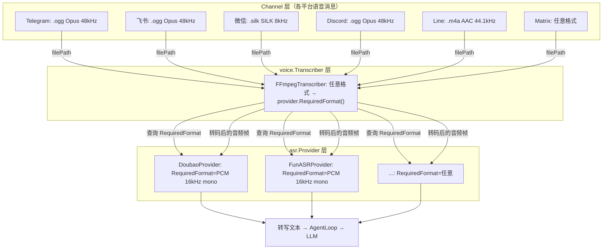

# ASR 适配器设计方案

> 状态：**待实施**  
> 关联 PR：#1642 (xiaozhi channel 集成)

## 背景

picoclaw 在 PR #1642 中新增了 doubao 和 funasr 两个 ASR provider（`pkg/asr/`），
它们接受实时 PCM 音频帧输入，服务于 xiaozhi 语音通道的流式场景。

同时，项目已有一套面向文本 channel 的语音消息处理链路：

```
Telegram/飞书收到语音消息 (.ogg)
→ 下载文件 → MediaStore
→ voice.Transcriber.Transcribe(filePath) → Groq Whisper API
→ [voice: 转写文本]
→ LLM 处理
```

当前 `voice.Transcriber` 只有一个实现（Groq Whisper，云端付费），无法复用本地免费的
doubao/funasr ASR provider。本设计方案旨在打通两者。

## 接口设计

### asr.Provider 新增格式声明

```go
// AudioFormat 描述音频数据格式
type AudioFormat struct {
    Codec      string // "pcm_s16le", "wav", "mp3"
    SampleRate int    // 16000, 48000, ...
    Channels   int    // 1=mono, 2=stereo
}

type Provider interface {
    RequiredFormat() AudioFormat        // 声明自己接受的格式
    Transcribe(ctx context.Context, frames [][]byte) (string, error)
}
```

doubao 和 funasr 返回：

```go
func (p *DoubaoProvider) RequiredFormat() AudioFormat {
    return AudioFormat{Codec: "pcm_s16le", SampleRate: 16000, Channels: 1}
}
```

未来新增 provider 可以声明不同格式，`FFmpegTranscriber` 无需修改。

### FFmpegTranscriber：格式协商 + 转码

```go
func (t *FFmpegTranscriber) Transcribe(ctx context.Context, filePath string) (*TranscriptionResponse, error) {
    dst := t.provider.RequiredFormat()
    // 根据 dst 动态构造 ffmpeg 参数
    args := []string{"-i", filePath, "-ar", strconv.Itoa(dst.SampleRate),
        "-ac", strconv.Itoa(dst.Channels), "-f", dst.Codec, "pipe:1"}
    // 读取 stdout → 切分为 frames → provider.Transcribe
}
```

## 方案：FFmpegTranscriber 适配器

### 转码后端选型结论

| 方案 | 格式覆盖 | 额外依赖 | 结论 |
|------|---------|---------|------|
| 纯 Go | 仅 MP3/WAV | 无 | ❌ 无法解码 Opus/SILK/AAC |
| CGo 多库（libopus + opencore-amr + fdk-aac…） | 全部 | 多个 C 库 | ❌ 构建和维护复杂度高 |
| **ffmpeg（外部进程）** | **全部** | **单一系统包** | **✅ 唯一实用选择** |

本地 ASR（funasr 等）强制要求裸 PCM 输入，无法绕过转码；各 channel 覆盖 Opus/SILK/AAC/AMR
多种格式；纯 Go 解码器缺失，CGo 多库维护成本高。因此 **ffmpeg 是唯一转码后端，不提供备选路径**。

### 通信架构



### DetectTranscriber

```go
func DetectTranscriber(cfg *config.Config) Transcriber {
    if asrProv, err := asr.CreateProvider(cfg); err == nil && asrProv != nil {
        return NewFFmpegTranscriber(asrProv)
    }
    return nil
}
```

### 文件规划

```
pkg/asr/
├── provider.go              # 修改: 新增 AudioFormat 类型 + RequiredFormat() 方法
└── providers/
    ├── doubao/              # 修改: 实现 RequiredFormat()
    └── funasr/              # 修改: 实现 RequiredFormat()

pkg/voice/
├── transcriber.go           # 修改: 简化 DetectTranscriber，删除 GroqTranscriber
└── ffmpeg_transcriber.go    # 新增: FFmpegTranscriber，动态协商格式 + 调用 ffmpeg
```

### 部署要求

| 场景 | 要求 |
|------|------|
| Docker 部署 | `RUN apt install -y ffmpeg`（加一行） |
| 本机部署 | 系统已装 ffmpeg（合理预期） |

## 当前状态

PR #1642 已完成：
- ✅ xiaozhi channel 集成到主网关（`pkg/channels/xiaozhi/`）
- ✅ XiaozhiConfig 配置化（`pkg/config/config.go`）
- ✅ 并发安全修复（asrMu、pipelineWg、turnID 快照）
- ✅ 嵌入 BaseChannel
- ✅ 删除独立 `cmd/picoclaw-voice/` 二进制
- ⏳ ASR 适配器（本文档描述的内容，下一个 PR）
