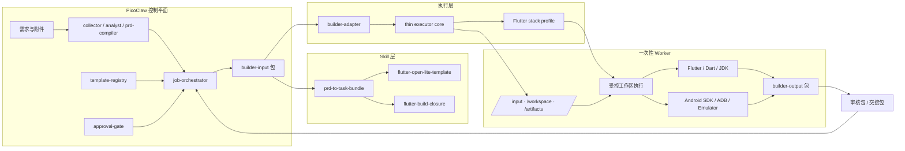

# PicoClaw 需求采集与产品研发编排平台设计（面向可运行 Android App）

> 状态：Frozen
>
> 本文档用于收敛当前讨论结论，明确 PicoClaw 在该方案中的产品定位、系统边界、核心流程、模块拆分、细化任务，以及人工必须介入的节点。

## 1. 文档目的

- 把当前讨论从“方向判断”收敛为可执行的设计文档。
- 明确 PicoClaw 在本方案中的定位不是“自动上架机器人”，而是“需求采集与产品研发编排平台”。
- 统一后续实现边界，避免目标再次发散到多平台、多技术栈、自动商业化闭环。
- 为后续 PRD Schema、模板注册表、自动开发流水线、人工审核流程提供基线。

### 1.1 开发阅读顺序

为了避免后续开发在多份设计稿之间来回跳转，V1 文档集收敛为三层主文档加一层 Schema：

- 本文档：看产品边界、模块职责、实施任务和总体路线。
- [demand-to-android-app-platform-interfaces.zh.md](demand-to-android-app-platform-interfaces.zh.md)：看公共 API、内部接口、错误模型和 Schema 映射。
- [demand-to-android-app-platform-todo.zh.md](demand-to-android-app-platform-todo.zh.md)：看后续待办清单与推进顺序。
- `docs/design/schemas/`：看机器可校验的结构化契约。

建议阅读顺序：主设计 -> 接口设计 -> TODO 清单 -> Schema。

## 2. 产品定位

PicoClaw 在本方案中的定位是：

**需求采集与产品研发编排平台**。

平台负责把零散需求、用户反馈、竞品观察、功能建议、人工访谈记录等输入，转化为结构化 PRD，并围绕该 PRD 编排一条可追踪的研发流水线，最终产出：

- 一份可审阅的产品 PRD。
- 一份结构化机器规格。
- 一套基于受控开源模板生成的 Android 项目源码。
- 一个可运行的 Android 调试产物。
- 一份可供人工审核、测试与后续发布使用的交接包。

平台**不负责**替代人的最终业务判断、法律责任承担、品牌资产审批、最终验收和应用商店操作。

## 3. 范围与目标

### 3.1 目标

- 目标平台收敛到 Android。
- 目标产物收敛到“可运行的 Android App”。
- 自动化目标是从结构化 PRD 产出可构建、可安装、可启动的 Android 工程。
- 平台输出必须包括源码、构建日志、测试结果、人工审核清单。
- MVP 默认支持的产品类型是**工具类 App**，不预先限定具体业务主题，但限定能力包络。
- MVP 允许联网，但不要求存在自建后台服务器。
- MVP 允许使用本地数据和第三方提供的服务接入。
- MVP 默认页面规模为 3 到 5 个核心页面。
- MVP 默认支持列表、详情、表单、设置这类典型工具型交互。
- MVP 默认模板项目应服务单一核心任务，功能专精，不做大而全产品壳。
- MVP 默认只要求在有限目标环境上跑通，不追求广泛设备型号和 Android 版本覆盖。

### 3.2 不做

- 不做 iOS 生成。
- 不做应用商店上架自动化。
- 不做多账号运营与收益扩张系统。
- 不做投流、ASO、付费转化优化。
- 不做任意 PRD 到任意技术栈的自由生成。
- 不做完全无人工参与的全自动发布。
- 不做登录与多角色体系。
- 不做支付、广告、推送、地图、实时通信。
- 不做复杂后台任务。
- 不接入高风险原生 SDK。
- 不把“必须有自建后台服务器”作为 MVP 前置条件。
- 不追求覆盖太多设备型号。
- 不追求支持过多 Android 版本跨度。
- 可要可不要的功能默认不做。

### 3.3 平台基线

- 默认执行架构为 `skill-first + thin executor + stack profile`。
- 默认工作区、状态与产物根目录为 `workspace/appfactory/`。
- Job 输入包固定落在 `jobs/{job_id}/prepare/`。
- public facade 对外暴露 PRD、模板、审批、Job、artifact、event、notification 等稳定对象。
- 运行时采用异步 Job 驱动，长任务通过 orchestrator 与 execution record 推进，不通过单次 HTTP 长连接等待结束。
- 默认验证链覆盖 `flutter pub get`、`flutter analyze`、`flutter test`、`flutter build apk --debug`，并预留设备安装与启动验证。
- 保留现场、恢复执行、通知投影、review/handoff/delivery 产物都属于平台长期对象模型的一部分。

## 4. 关键设计原则

- **PRD 优先于自由对话**：后续研发必须以结构化 PRD 为唯一主输入，不允许直接拿零散聊天内容驱动代码生成。
- **模板优先于从零生成**：优先基于受控模板做定制化改造，不追求从空白目录自由生成完整应用。
- **模板矩阵按阶段演进**：长期应按能力包络拆成多份模板，分别覆盖不同功能板；但第一阶段只启用一个最小化 MVP 模板，先打稳主链路。
- **单技术栈优先**：V1 只允许一种 Android 技术栈，避免同时支持多栈导致质量失控。
- **成本优先于覆盖面**：V1 优先用最小成本打通主链路，不为低价值兼容性、额外设备覆盖和可选能力付费。
- **可选能力默认删除**：能省则省，可要可不要的能力一律不进入 MVP。
- **无自建服务器默认前提**：模板项目不得把自建后端作为基础依赖，除非后续有明确新模板专门承接。
- **无广告默认前提**：广告不属于当前平台主线能力，不进入默认模板。
- **功能专精优先于功能堆叠**：默认模板项目应围绕单一核心任务闭环，而不是预埋泛功能外壳。
- **人工门禁不可移除**：产品确认、模板选型确认、代码验收、测试验收必须保留人工节点。
- **可追溯**：每个需求、每个决策、每个生成结果都必须能追溯到来源、版本和审核记录。
- **可重放**：同一份 PRD、同一模板版本、同一配置，应能重复生成接近一致的结果。
- **许可可控**：只允许进入受控模板注册表的开源项目参与自动开发。
- **工作区隔离**：每个产品任务都需要独立工作区，避免上下文、依赖和生成物污染。
- **Docker 优先执行环境**：开发、构建、验证默认在 Docker 中完成，项目代码和产物通过外部挂载进入容器。

## 5. 推荐 V1 技术决策

### 5.1 Android 技术栈

建议 V1 固定为 **Flutter**。

#### 5.1.1 选择 Flutter 的原因

- Android 构建链成熟，工程结构稳定。
- 开源模板数量足够多，便于建立模板注册表。
- 页面、状态、导航、资源目录模式较统一，适合模板化改造。
- 本地与 CI 的构建验证路径清晰。
- 单一 SDK 即可覆盖页面、路由、状态、资源、测试与构建主流程，便于 Builder 在单一工具链内收敛。
- Widget 树和声明式 UI 结构相对统一，适合基于 PRD 做页面级和组件级改造。
- 标准命令链清晰，容易固化为可执行脚本：`flutter pub get`、`flutter analyze`、`flutter test`、`flutter build apk --debug`。
- 更适合“模板优先”的路线：大量中小型 Flutter 模板可以被纳入受控模板注册表后做定制化改造。

#### 5.1.2 模板策略

当前模板策略明确收敛为两层：

- 长期策略：模板应拆成多份，每份模板覆盖一类相对稳定的功能包络，而不是试图用一个超级模板承接所有需求。
- 第一阶段策略：只启用一个最小化 MVP 模板，先验证 `PRD -> task bundle -> builder-runtime -> analyze/test/build` 这条主链是否稳定。

这里说的“多份模板”，指的是未来按能力边界拆分，例如：

- 通用 CRUD / tracker 类模板
- 记账类模板
- 更偏内容展示的轻交互模板

但这些都属于后续阶段。第一阶段不追求模板数量，而追求：

- 模板边界足够清晰
- AI 拆任务足够稳定
- 回归和治理成本足够低

因此，当前第一阶段模板口径固定为：

- 内部模板 ID：`flutter-open-lite`
- 模板类型：最小化 MVP 模板
- 架构口径：MVP 友好的固定分层模板
- 模板产品限制：无自建服务器前提、无广告、功能专精、可选能力默认删除

#### 5.1.3 暂不选择其他技术栈的原因

**React Native（含 Expo）暂不作为 V1 首选：**

- React Native 官方推荐配合框架使用，实际工程会分裂为 Expo 路线和 bare React Native 路线，模板差异大。
- 需要同时处理 Node 生态和 Android 原生生态，自动化改造时组合复杂度更高。
- 原生模块接入、构建配置和框架升级路径更容易引入模板间不一致问题。

**Kotlin + Jetpack Compose 暂不作为 V1 首选：**

- 如果目标是深度原生 Android 能力，它长期可能更优，但对自动 Builder 的收敛难度更高。
- Gradle、Manifest、权限、模块拆分、生命周期等原生细节更多，错误修复链更长。
- 对当前“先跑通 PRD 到可运行 App 的闭环”这一目标而言，成本不如 Flutter 可控。

如果团队已有强约束必须使用其他技术栈，可以替换为 React Native，但**不能并行支持两套技术栈**。

### 5.2 执行引擎与 Builder 形态

执行引擎采用 **skill-first + 技术栈无关的 thin executor 内核**。

在这条路线下：

- PicoClaw 继续作为控制平面。
- skill 负责模板约束、PRD 编译、task bundle 生成和收口策略。
- thin executor 内核负责在受控工作区里执行结构化编辑、命令链、日志采集和产物归档。
- 技术栈相关能力通过 profile / adapter 下沉，不进入执行器核心状态机。
- Docker 继续作为默认执行环境。

#### 5.2.1 为什么改为 skill-first + thin executor

- 当前平台真正要沉淀的是“需求如何被稳定编译成任务包”和“任务如何被稳定验证”，而不是继续依赖另一个完整系统替 PicoClaw 承担主执行逻辑。
- skill 更适合承载模板约束、任务拆分规则、验收清单和低风险收口策略，这些内容本来就是 PicoClaw 的平台知识。
- thin executor 内核只保留最小必要运行时能力，比重型外部 Builder 更容易与当前状态机、artifact、审批和治理模块对齐。
- 如果执行器内核直接绑定 Flutter、Android 或某个外部 Builder，后续扩展到 Web、Go 服务或其他移动栈时就会再次把系统核心做窄，因此核心协议必须先与技术栈解耦。
- 对当前阶段而言，先把 `PRD -> task bundle` 打稳，比继续追求一个更强但更重的外部执行器更符合投入产出比。

#### 5.2.2 执行器内核与技术栈 profile 的边界

新的执行器应拆成两层：

- 通用执行器内核：负责 round state、workspace patch、验证编排、repair 收敛和 artifact 归档。
- 技术栈 profile：负责目录探测、结构性检查、命令白名单、种子工程判定和技术栈特定 repair 上下文。

这意味着：

- Flutter/Android 只是首个验证 profile，不是执行器核心语义。
- 后续支持 Web、Go、Python、Node 或其他 Android 技术栈时，应新增 profile，而不是重写执行器内核。
- `RoundInput`、`RoundOutput`、`WorkspacePatch`、`ValidationResult` 这类对象必须先做成技术栈无关契约。

#### 5.2.3 thin executor 内核的职责边界

thin executor 内核 **负责**以下事项：

- 在独立工作区中加载已选定模板和 `builder-input.json`。
- 按 task bundle 顺序驱动结构化代码修改。
- 应用 `WorkspacePatch`，并确保改动受 allowed paths 和工作区策略约束。
- 调度 profile 暴露的验证步骤与 repair 轮次。
- 记录日志、失败签名、检查结果和产物路径。
- 支持最小必要的 stop、retry、resume 和失败现场保留。

thin executor 内核 **不负责**以下事项：

- 需求采集。
- PRD 生成。
- 模板选型。
- 审批流。
- 最终交付裁决。

补充边界说明：

- `lib/picoclaw_executor_probe.dart` 这类 probe 产物只用于默认 thin executor fallback 证明链，证明受控工作区、allowed paths 和最小 inspect/edit/validate 闭环仍可执行。
- 真实 builder-runtime 成功路径不应再以 probe 文件作为完成信号，而应以 `WorkspacePatch`、Flutter validate 结果、构建产物和交付报告为主证据。

#### 5.2.4 技术栈 profile 的职责边界

技术栈 profile **负责**以下事项：

- 识别当前工作区属于哪种技术栈或模板族。
- 提供结构性验收规则，例如 Flutter counter demo 判定、Go service 目录约束、Web 入口文件约束等。
- 提供命令级验收计划，例如 `flutter analyze`、`go test`、`npm test`。
- 生成技术栈相关的 repair context，但不接管执行循环。

技术栈 profile **不负责**以下事项：

- 不直接掌控 run 状态机。
- 不直接改写 artifact / 审批 / 恢复语义。
- 不绕过通用 patch、budget 和审计规则。

#### 5.2.5 skill 在本方案中的定位

skill 层主要承载三类内容：

- 模板知识：当前激活模板的目录约束、依赖白名单和命名规则；第一阶段先收敛为单一最小化 MVP 模板。
- 编排知识：把 PRD 编译成 `implementation-plan.md`、`builder-input.json` 和 `task_bundle` 的规则。
- 收口知识：在 analyze、test、build 之前后只允许做哪些低风险修复。

当前推荐起步 skill 仍然是：

- `flutter-open-lite-template`
- `prd-to-task-bundle`
- `flutter-build-closure`

说明：

- 当前仍以 Flutter profile 作为第一条主链验证对象，因此 skill 仍然保留 Flutter 命名。
- 长期允许模板 skill 扩展成多份，但第一阶段仍只启用 `flutter-open-lite-template` 这一条默认模板知识包。
- 但这些 skill 属于“当前技术栈知识包”，不应与执行器内核绑定为同一层。

#### 5.2.6 兼容分支定位

外部 Builder 兼容分支不属于默认执行路径，也不参与核心接口语义定义。默认执行路径始终以 `skill-first + thin executor + stack profile` 为准；如需保留兼容分支，只能作为受控适配层存在，不能反向塑造平台主模型。

#### 5.2.7 builder-runtime 的模型策略

builder-runtime 的长期目标不是绑定单一模型或单一推理后端，而是接入统一模型池，并按任务类型做受控路由。

当前结论如下：

- builder-runtime 首轮验证以后端可替换为前提，不把 `Ollama`、`vLLM`、`LiteLLM` 或任一云 Provider 写死成架构前提。
- 近阶段先以 `Ollama + qwen2.5-coder:14b` 作为本地验证后端，优先证明高频窄任务是否能稳定完成；`qwen2.5-coder:32b` 作为复杂修复升级层参与后续 A/B 对比。
- 中长期建议把 builder-runtime 接到统一模型路由层，允许本地模型承担单文件实现、双文件接线、低风险 analyze/test 修复，让高质量云模型只处理规划、复杂 repair 和多文件高风险修改。
- 模型路由必须按任务形态和失败状态决定，不能只按“当前默认模型”一把梭。至少应区分：规划类任务、窄编码任务、低风险收口任务、高风险升级任务。
- 任何本地模型验证都不改变现有平台主边界：PicoClaw 继续负责控制平面；skill 继续负责模板约束、任务编译和收口知识；builder-runtime 只在 `builder-input.json`、`task_bundle`、`WorkspacePatch` 和 acceptance checks 的受控边界内执行。

因此，当前推荐路线是：

- 先用 `Ollama` 快速验证本地模型是否足够承担 builder-runtime 的高频窄任务。
- 评估稳定后，再决定是否保留 `Ollama` 作为本地开发后端，或升级到更适合统一服务化和并发执行的 `vLLM` / `LiteLLM` 路线。
- 无论底层后端如何变化，builder-runtime 暴露给平台的都应是统一的任务路由、重试、升级和失败上报语义，而不是 Provider 特定逻辑。

为避免这套策略继续停留在文档层，配置层先收敛为一套最小骨架：

- `appfactory.builder_runtime.default_model`：默认高频窄任务模型，可直接复用 `model_list` 中的别名，并支持 fallback。
- `appfactory.builder_runtime.upgrade_model`：复杂修复或失败升级时使用的更强模型，同样复用 `model_list`。
- `appfactory.builder_runtime.task_routes[]`：按 `task_type` 指定任务级模型路由，近阶段至少覆盖 `single_file_edit`、`dual_file_wiring`、`analyze_repair`、`test_repair`、`closure_repair`。
- `appfactory.builder_runtime.upgrade_threshold`：先显式配置升级阈值，至少包括 repair 次数上限、多文件风险阈值，以及 validation fail、patch parse fail、scope violation 这类强制升级信号。

### 5.3 默认交付物

- Flutter 工程源码。
- 可构建的 Debug APK。
- 构建日志。
- 自动测试报告。
- 人工审核包。

### 5.4 默认研发模式

- 先形成 PRD。
- 再做模板匹配。
- 再做差异化改造。
- 最后做自动验证与人工验收。

## 6. 目标产物定义

| 产物 | 说明 | 是否必须 |
|---|---|---|
| `PRD.md` | 给人看的产品文档 | 是 |
| `PRD.json` | 给机器执行的结构化规格 | 是 |
| `template-fit-report.md` | 模板适配与差距分析 | 是 |
| `implementation-plan.md` | 自动开发任务图与改造计划 | 是 |
| Android 源码工作区 | 基于模板生成的工程 | 是 |
| Debug APK | 可安装、可启动的 APK | 是 |
| `build-report.md` | 构建结果、失败点、修复记录 | 是 |
| `smoke-test-report.md` | 冒烟测试结果 | 是 |
| `review-bundle.md` | 给人工审核的汇总文档 | 是 |
| `handoff-checklist.md` | 给人工测试、签名、发布使用的交接清单 | 是 |

### 6.1 “可运行 Android App”的最低定义

满足以下条件，才算达到当前目标：

- 工程依赖可以成功解析。
- Debug APK 可以成功构建。
- APK 可以安装到模拟器或真机。
- App 启动后不会立即崩溃。
- PRD 中定义的核心页面和主流程可以进入。
- 自动冒烟测试至少覆盖启动、导航、关键入口页。
- 人工审核包完整可读。

## 7. 系统边界

### 7.1 PicoClaw 平台负责的范围

- 需求采集。
- 需求清洗、聚类、归一。
- 结构化 PRD 生成与版本管理。
- 模板检索、筛选、匹配、差距分析。
- 研发任务拆解与执行编排。
- 代码修改、构建、自动测试、日志收集。
- 产出审核包和交接包。

### 7.2 外部系统负责的范围

- 开源模板源码托管平台。
- Android SDK、JDK、Gradle、Flutter 工具链。
- 模拟器或真机运行环境。
- 设计图、图标、文案、品牌资产来源。
- 后端接口或 Mock 数据源。

### 7.3 人工负责的范围

- 需求澄清与优先级确认。
- PRD 审批。
- 模板选型拍板。
- 品牌资产、文案、法务素材提供。
- 关键逻辑和高风险代码审核。
- 真机体验测试和最终验收。
- 签名、分发、上架等操作。

### 7.4 整体模块划分

从系统实现视角看，整个项目不应被理解为“一个 Builder 加一堆 skill”，而应拆成一组有明确边界的模块。

建议将整个项目拆成三层：

- 控制平面：负责需求理解、PRD 编排、任务状态、人工门禁、结果汇总。
- 执行平面：负责真实代码改造、构建、安装、启动、冒烟验证。
- 资产与治理平面：负责模板、产物、审计、许可证、权限与重放信息。

建议的模块总表如下：

| 模块 | 所属层 | 核心职责 | 主要输入 | 主要输出 | 建议实现形态 |
|---|---|---|---|---|---|
| `demand-ingest` | 控制平面 | 接收文本、链接、附件、聊天记录、会议纪要 | 外部需求源 | 原始需求包 | PicoClaw 内部模块 |
| `demand-normalizer` | 控制平面 | 去重、聚类、抽取主题、识别约束与冲突 | 原始需求包 | 归一化需求集合 | PicoClaw Agent + skill |
| `prd-engine` | 控制平面 | 生成 `PRD.md`、`PRD.json` 并做 schema 校验 | 归一化需求集合 | 结构化 PRD | PicoClaw Agent + skill + schema 校验器 |
| `approval-gate` | 控制平面 | 管理人工审批、退回、版本切换、门禁状态 | PRD、模板建议、构建结果 | 审批记录与状态切换 | PicoClaw 内部状态模块 |
| `template-registry` | 资产与治理平面 | 管理模板元数据、固定版本、许可、健康状态、能力标签 | 模板仓库信息、构建证明 | 候选模板集合、模板适配输入 | 独立仓库或独立服务 |
| `planning-engine` | 控制平面 | 把 PRD 和模板差距报告转成实施计划与任务包 | 已批准 PRD、模板适配报告 | `implementation-plan.md`、`builder-input.json` | PicoClaw Agent + skill + 打包逻辑 |
| `job-orchestrator` | 控制平面 | 维护任务状态机、预算、重试、人工接管与恢复点 | 任务定义、审批结果、执行反馈 | Job 状态、调度动作 | PicoClaw 内部模块，不能只靠 skill |
| `builder-adapter` | 控制平面与执行边界 | 调用 Builder、传递输入包、消费输出包、标准化返回结果 | Builder 输入包 | Builder 输出包、运行状态 | PicoClaw 内部模块，不能只靠 skill |
| `worker-manager` | 执行平面 | 创建/销毁 worker、挂载工作区与缓存、应用网络与命令策略 | Job 配置、镜像配置 | 可执行 worker 实例 | 独立运行时模块 |
| `builder-runtime` | 执行平面 | 在模板工程里按 task bundle 执行结构化编辑、命令链和收口 | Builder 输入包、源码工作区、stack profile | 代码改动、构建结果、失败摘要 | 技术栈无关 thin executor 内核 + stack profile |
| `android-validation` | 执行平面 | 执行 analyze、test、build、install、launch、smoke、截图、日志采集 | 工作区、APK、命令策略 | `build-report.md`、`smoke-test-report.md`、验证产物 | Worker 内系统模块 + 脚本 |
| `review-handoff` | 控制平面 | 汇总变更、风险、阻塞项、人工测试清单和交接清单 | Builder 输出包、验证产物 | 审核包、交接包 | PicoClaw Agent + skill |
| `governance-audit` | 资产与治理平面 | 许可证扫描、权限变化记录、敏感信息脱敏、审计链路、重放清单 | 模板信息、依赖信息、构建产物 | 合规报告、审计记录 | 系统模块 + 规则引擎 |
| `artifact-state-store` | 资产与治理平面 | 保存 PRD、任务状态、日志、APK、截图、报告、审批记录 | 全流程中间结果与最终产物 | 可追溯记录、归档产物、恢复现场 | 存储模块，不能只靠 skill |

可以把这 14 个模块进一步压缩成 6 个一级域：

- 输入域：`demand-ingest`、`demand-normalizer`
- 产品定义域：`prd-engine`、`approval-gate`
- 研发编排域：`planning-engine`、`job-orchestrator`、`builder-adapter`
- 执行域：`worker-manager`、`builder-runtime`、`android-validation`
- 交付域：`review-handoff`
- 治理与资产域：`template-registry`、`governance-audit`、`artifact-state-store`

#### 7.4.1 哪些模块适合主要做成 skill

以下模块适合主要通过 skill 承载方法论、提示词模板和辅助脚本：

- `demand-normalizer`
- `prd-engine`
- `planning-engine`
- `review-handoff`

这些模块的共同特点是：

- 以“理解、归纳、生成、总结”为主。
- 对持久状态依赖较弱。
- 更适合把规则、模板、检查清单和脚本封装进 skill。

#### 7.4.2 哪些模块不能只靠 skill

以下模块不能只靠 skill 实现，必须有明确的系统模块或服务：

- `approval-gate`
- `job-orchestrator`
- `builder-adapter`
- `worker-manager`
- `android-validation`
- `governance-audit`
- `artifact-state-store`

这些模块之所以不能只靠 skill，是因为它们都需要至少一种系统级能力：

- 持久状态。
- 明确输入输出契约。
- 可重复执行的运行时控制。
- 预算、停止条件和失败恢复。
- 对日志、产物、权限、许可证的确定性处理。

因此，整个项目最合适的落地方式是：

- 用系统模块搭骨架。
- 用 skill 补认知流程。
- 用技术栈无关的 thin executor 内核 / 过渡执行 Worker 承担受控执行。

#### 7.4.3 Flutter 固定分层模板与 workflow skill 的起步落地

如果后续决定把工具类 Android App 的自动开发进一步收敛到“固定 Flutter 通用模板 + 多 skill 协作”的路线，建议把 skill 主要放在 `planning-engine` 和 `review-handoff` 这类认知型环节，而不是把整个系统误拆成 `model skill`、`view skill`、`controller skill` 三块。

当前模板选型已经收敛为：

- 内部模板 ID：`flutter-open-lite`
- 模板架构口径：MVP 友好的固定分层模板
- 外部主要参考来源：`zubairehman/flutter_boilerplate_project`

当前更推荐的起步拆法是三段式：

- `flutter-open-lite-template`：固定目录结构、依赖白名单、命名规则、依赖方向和可接受的页面组织方式。
- `prd-to-task-bundle`：把已批准 PRD 编译成实体、页面、用户流程和 acceptance checks 对应的任务包。
- `flutter-build-closure`：在工作区接近完成时执行 analyze、test、build，并只做低风险、可回放的收口修复。

这样做的原因有三点：

- skill 以工作流阶段为边界时，输入输出更稳定，更适合接入 `builder-input.json` 的 `task_bundle`。
- 固定模板以后，Builder 不再需要反复发明 Flutter 工程结构，尾部收敛成本更低。
- `android-validation`、`worker-manager`、`builder-adapter` 这类需要确定性运行时控制的模块，仍然保留在系统层，不会被 skill 误承载。

因此，本仓库对这条路线的推荐实现口径是：

- 系统层负责状态机、输入输出契约、工作区和验证执行。
- skill 层负责模板约束、PRD 到任务包的认知编译、以及验证前后的低自由度修复策略。
- Builder 只在固定模板与固定任务包边界内执行代码生成和修改。

## 8. 端到端流程

| 阶段 | 平台自动化动作 | 人工动作 | 输出 |
|---|---|---|---|
| 1. 需求录入 | 接收文本、访谈纪要、工单、聊天记录、链接、附件 | 补充背景、目标、限制条件 | 原始需求包 |
| 2. 需求清洗 | 去重、聚类、抽取主题、识别冲突和空白项 | 确认误归类与歧义项 | 归一化需求集合 |
| 3. 机会收敛 | 提炼目标用户、核心场景、产品边界、Android 可行性约束 | 确认做或不做、删减不必要范围 | 产品目标草案 |
| 4. PRD 生成 | 输出 `PRD.md` 和 `PRD.json` | 审批 PRD、退回补充 | 已批准 PRD |
| 5. 模板匹配 | 在受控模板库中检索、打分、生成差距报告 | 在候选模板中拍板或否决 | 模板适配报告 |
| 6. 方案规划 | 输出实现计划、代码改造任务图、依赖调整清单 | 审核关键架构决策 | 实施计划 |
| 7. 自动开发 | 克隆模板、创建工作区、按 PRD 改造代码、生成资源占位、补全配置 | 处理平台无法自动判定的分支选择 | Android 源码工程 |
| 8. 自动验证 | 执行格式化、静态检查、单元测试、构建、安装、启动、冒烟测试 | 查看失败原因是否需要改 PRD 或换模板 | 构建与测试报告 |
| 9. 审核准备 | 汇总变更摘要、风险点、已知缺口、人工检查项 | 做代码审核与体验审核 | 审核包 |
| 10. 交付 | 归档源码、APK、日志、清单 | 做最终验收并决定后续签名或发布动作 | 交接包 |

## 9. 核心数据对象

### 9.1 原始需求包

原始需求包用于保留未经加工的输入，必须包含以下字段：

| 字段 | 是否必须 | 说明 |
|---|---|---|
| `source_id` | 是 | 来源唯一标识 |
| `source_type` | 是 | 来源类型，如聊天、文档、工单、会议纪要 |
| `raw_content` | 是 | 原始内容 |
| `attachments` | 否 | 图片、链接、附件列表 |
| `submitted_by` | 否 | 提交人 |
| `business_context` | 否 | 背景说明 |
| `constraints` | 否 | 显式限制 |
| `created_at` | 是 | 创建时间 |

### 9.2 结构化 PRD

正式 schema 文件已落在：

- `docs/design/schemas/prd.schema.json`

`PRD.json` 必须至少覆盖以下字段：

| 字段 | 是否必须 | 说明 |
|---|---|---|
| `id` | 是 | PRD 唯一标识 |
| `title` | 是 | 产品名称 |
| `summary` | 是 | 产品摘要 |
| `problem_statement` | 是 | 要解决的问题 |
| `target_users` | 是 | 目标用户 |
| `core_scenarios` | 是 | 核心使用场景 |
| `goals` | 是 | 当前版本目标 |
| `non_goals` | 是 | 当前明确不做 |
| `feature_list` | 是 | 功能列表 |
| `screen_list` | 是 | 页面清单 |
| `user_flows` | 是 | 主流程 |
| `data_entities` | 是 | 数据实体 |
| `integrations` | 否 | 外部接口与依赖 |
| `permissions` | 否 | Android 权限需求 |
| `asset_requirements` | 否 | 图标、启动图、插图、文案需求 |
| `template_constraints` | 是 | 模板筛选条件 |
| `acceptance_criteria` | 是 | 验收标准 |
| `manual_review_points` | 是 | 人工必须确认的点 |
| `known_unknowns` | 是 | 当前仍不明确的问题 |

### 9.3 模板清单对象

正式 schema 文件已落在：

- `docs/design/schemas/template-registry-entry.schema.json`

模板注册表中的每条模板记录必须包含：

| 字段 | 是否必须 | 说明 |
|---|---|---|
| `template_id` | 是 | 模板唯一标识 |
| `name` | 是 | 模板名称 |
| `repo_url` | 是 | 模板仓库地址 |
| `pinned_ref` | 是 | 固定 commit 或 tag |
| `license` | 是 | 许可证类型 |
| `stack` | 是 | 技术栈 |
| `android_support` | 是 | 是否支持 Android |
| `capabilities` | 是 | 模板能力标签 |
| `excluded_capabilities` | 否 | 不支持能力 |
| `build_proof` | 是 | 最近一次成功构建记录 |
| `test_proof` | 否 | 最近一次成功测试记录 |
| `risk_notes` | 否 | 模板风险说明 |
| `owner` | 否 | 模板维护人 |

### 9.4 生成任务对象

正式 schema 文件已落在：

- `docs/design/schemas/job.schema.json`

每次自动开发都应生成一个独立任务对象：

| 字段 | 是否必须 | 说明 |
|---|---|---|
| `job_id` | 是 | 任务唯一标识 |
| `prd_id` | 是 | 对应 PRD |
| `prd_version` | 是 | PRD 版本 |
| `template_id` | 是 | 使用的模板 |
| `workspace_path` | 是 | 工作区路径 |
| `status` | 是 | 当前状态 |
| `logs` | 是 | 关键日志 |
| `artifacts` | 是 | 产物清单 |
| `human_approvals` | 是 | 人工审批记录 |

### 9.5 审批记录对象

正式 schema 文件已落在：

- `docs/design/schemas/approval-record.schema.json`

每个需要人工门禁的节点都应生成一条审批记录对象：

| 字段 | 是否必须 | 说明 |
|---|---|---|
| `approval_id` | 是 | 审批记录唯一标识 |
| `approval_type` | 是 | PRD、模板、执行方案、构建结果、交接包等 |
| `job_id` | 否 | 如与任务相关则记录 |
| `prd_id` | 否 | 如与 PRD 相关则记录 |
| `subject_version` | 是 | 当前审批对象冻结版本标识；对 PRD 不能只写裸版本号，而要能同时区分 `PRD.json`、`PRD.md` 与 `requirement.md` 在同版本下的内容变化；对模板审批也不能只写 `template_id + pinned_ref`，而要能区分模板匹配结果内容变化 |
| `status` | 是 | 待审批、已通过、已拒绝、要求修改等 |
| `requested_by` | 是 | 谁发起了审批 |
| `assignee` | 否 | 谁负责审批 |
| `decision` | 否 | 审批结果 |
| `summary` | 否 | 审批摘要 |
| `evidence_paths` | 否 | 附带证据路径 |

### 9.6 审核包对象

审核包至少要包含：

- 当前 PRD 摘要。
- 模板匹配结果。
- 变更摘要。
- 自动测试结果。
- 已知风险与缺口。
- 人工体验检查项。
- 真机验证建议。
- 需要人工提供或确认的材料。

## 10. 基于 PicoClaw 的角色拆分

建议将平台内的职责拆分为多个 Agent 角色，由 PicoClaw 负责编排：

| Agent 角色 | 主要职责 | 需要的能力 |
|---|---|---|
| `collector` | 收集原始需求与附件 | 文件、Web、消息、表单接入 |
| `analyst` | 清洗、聚类、归一化需求 | 文本分析、聚类、摘要 |
| `prd-compiler` | 生成 `PRD.md` 与 `PRD.json` | 模板化文档生成、Schema 校验 |
| `template-scout` | 在模板注册表中匹配候选模板 | 搜索、比对、许可证规则 |
| `architect` | 输出实现方案与改造策略 | 差异分析、模块划分 |
| `builder` | 修改代码、修复构建、推进工程成型 | 文件编辑、命令执行、构建修复 |
| `tester` | 执行自动测试与冒烟验证 | 测试编排、日志分析、截图采集 |
| `review-prep` | 生成审核包和交接清单 | 汇总、归档、清单生成 |

### 10.1 执行组件落位

在当前方案中，`builder` 更准确地说是一个由 PicoClaw 调度的执行组件集合，而不是长期固定绑定某个外部系统。

推荐落位方式如下：

- PicoClaw 负责准备执行输入包、启动 worker、观察任务状态、接收结果。
- skill 层负责模板约束、任务编译、acceptance checks 和低风险收口规则。
- thin executor 运行在独立 worker 中，负责按 task bundle 驱动结构化编辑、调用技术栈 profile、执行命令白名单、采集日志和归档产物。
- 执行链围绕 `skill + executor + stack profile` 组织，外部 builder 不作为默认前提。
- Android 工具链、模拟器和日志采集器作为 worker 的执行环境存在，不直接暴露给上层需求编排逻辑。

这意味着：

- PicoClaw 关注“做什么、何时停、何时审批”。
- skill 关注“怎么拆任务、怎么约束模板、怎么定义收口”。
- thin executor 内核关注“如何在受控工作区把任务做完”。
- 技术栈 profile 关注“某种工程应如何被识别、验证和收口”。
- Worker 关注“在哪里执行、如何验证、如何归档”。

### 10.2 PicoClaw + Skill + Thin Executor Core + Stack Profile + Worker 架构图

下图描述的是当前主线架构下控制平面、skill、通用执行器内核、技术栈 profile 和一次性 Worker 的最小闭环。

## 11. 开发里程碑

本章只保留长期里程碑结构，不记录阶段性验证过程或实施回顾。

详细公共 API、内部接口和 schema 映射见 [demand-to-android-app-platform-interfaces.zh.md](demand-to-android-app-platform-interfaces.zh.md)。

### 11.1 里程碑划分原则

- 每个里程碑都必须对应一个可以演示或明确验收的结果，而不是“完成了一批分散任务”。
- 前一里程碑的输出必须是后一里程碑的输入，避免并行开发把系统边界打散。
- 里程碑以出口标准为准，不以任务数量为准。
- `FND`、`COL`、`PRD`、`TPL`、`DEV`、`AND`、`REV`、`GOV` 这些编号只作为追溯标签存在。

### 11.2 M1 执行语义与默认生成结果收敛

- 目标：先把当前最容易误导人、最容易产生“链路能跑但结果不可依赖”的部分收紧。
- 覆盖模块：`public job facade`、`jobs 运维视图`、`notifications`、`orchestrator signal`、`thin executor`、`flutter profile`

关键关注点：
	- `status`、`phase`、`failure_domain`、`failure_category`、`human_approvals` 与通知投影必须统一语义。
	- 默认 Flutter 落点、持久化方案、依赖选择与模板约束必须继续收敛。
	- 默认生成结果必须继续稳定通过结构检查与 build 链，而不是靠一次性样本证明。

### 11.3 M2 自动验证与交付闭环补齐

- 目标：把当前“能 build 出 APK”继续推进到“能给出可追溯运行证据和交付信号”。
- 覆盖模块：`android-validation`、`artifact-state-store`、`review-handoff`、`delivery record`
- 出口方向：
	- 默认 public-job Flutter 主线能补上设备安装、启动、最小日志与截图证据。
	- `smoke-test-report`、artifact manifest、review bundle、handoff checklist、delivery record 形成统一链路。
	- 人工 review、退回、签名或发布决策能稳定投影回 job detail、events 与 notifications。

### 11.4 M3 长期回归资产与内部试运行准备

- 目标：让默认主线从“可手动复跑”升级为“可长期维护的内部平台能力”。
- 覆盖模块：`orchestrator`、`notifications`、`governance-audit`、`template-registry`、`builder pool / worker policy`
- 出口方向：
	- full / fast 两条默认验证入口有明确触发场景，并能进入持续回归。
	- orchestrator、恢复、通知和值班控制面具备更稳定的长期语义。
	- 模板治理、权限/高风险依赖提醒、交付资产脱敏和审计链继续补齐。

### 11.5 开发时必须盯住的实现约束

- Builder 输入输出不再在主文档展开字段级说明，统一以 `builder-input.schema.json` 和 `builder-output.schema.json` 为准。
- Worker 形态固定为一任务一 Worker，失败优先保留现场，不做隐式共享工作区。
- 开发与执行环境默认 Docker 化，项目代码、输入包、产物均通过外部挂载进入容器，不依赖宿主机散装环境。
- V1 默认只要求在单一基准模拟器配置和有限 Android API 档位上跑通，不追求广泛设备 / 版本兼容性。
- 能省则省，可要可不要的一律不做；新增能力必须直接服务当前平台主线。
- Builder 标准命令链固定为：
	- 基线检查：`flutter --version`、`flutter doctor -v`、`flutter pub get`、`flutter analyze`、`flutter test`
	- 低成本循环检查：`dart format .`、`flutter analyze`、`flutter test`
	- 里程碑构建：`flutter build apk --debug`
	- 安装与启动验证：`adb wait-for-device`、`adb install -r ...`、`adb shell monkey -p <applicationId> -c android.intent.category.LAUNCHER 1`、`adb logcat -d`
- Builder 停止条件固定为四类：成功停止、立即失败、预算停止、人工升级。
- 任何大模型请求失败都必须先自动重试；长时间无法连接大模型时，必须通知人工干预，不能让工作流静默卡死。
- 详细接口见接口文档，详细待办见 TODO 文档，主文档只保留里程碑、边界和出口标准。

## 12. 人工必须介入的事项

### 12.1 当前范围内必须人工参与的事项

- 确认原始需求没有严重歧义。
- 审批结构化 PRD。
- 在多个候选模板中做最终选择，或否决当前模板。
- 提供品牌资产、产品名称、文案口径、接口说明。
- 审核高风险功能的实现方向。
- 准备可用模拟器或真机，并完成 `adb install -r`、启动、`logcat` 和截图确认。
- 做至少一轮人工体验验证。
- 对最终产物做可用性验收。

### 12.2 当前范围外，但必须在交接包中体现的人工事项

- 真实 API 密钥与生产配置注入。
- Release Keystore 创建与保管。
- Release 包签名。
- 隐私政策与用户协议撰写和托管。
- 应用商店元数据、截图、分类、权限说明准备。
- 应用商店上传、审核沟通与发布。

这些事项虽然不属于当前目标范围，但平台必须在文档和交接包中显式提示，不能“默认由后续自己处理”。

## 13. 推荐仓库与系统拆分

建议不要把所有能力直接塞进 PicoClaw 主仓，而是拆成以下边界：

| 组件 | 角色 |
|---|---|
| `picoclaw` | 控制平面，负责需求采集、PRD 编排、任务调度、审核协同 |
| `template-registry` | 受控模板注册表，维护模板清单、标签、许可和健康状态 |
| `appfactory-executor-worker` | 基于通用 thin executor 内核的隔离执行 Worker，按需加载 Flutter 等 stack profile，必要时挂历史兼容层，负责代码改造、构建、测试和失败收敛 |
| `android-build-runner` | 预装 Flutter、Android SDK、JDK、ADB、模拟器的执行环境，可为本地或 CI 镜像 |
| `generated-app-workspaces` | 每个产品的独立生成工作区 |

## 14. 验收标准

平台验收标准如下：

- 输入一组可解释的需求后，平台能生成结构化 PRD。
- PRD 经人工批准后，平台能给出模板适配报告。
- 模板确认后，平台能产出 Android 工程源码。
- 平台能完成 Debug APK 构建。
- APK 能在模拟器中安装并启动。
- 自动冒烟测试能覆盖关键页面入口。
- 平台能产出人工审核包和交接包。
- 所有人工必做事项都在文档中被显式列出。

## 15. 后续扩展方向（不属于当前范围）

- iOS 支持。
- Release 包自动签名。
- 上架资料生成。
- 应用商店上传与审核辅助。
- 更复杂的后端生成与联调。
- 多模板、多技术栈扩展。
- 多项目组合管理与资产复用。

## 16. 结论

PicoClaw 在本方案中的定位是“需求采集与产品研发编排平台”，而不是“自动上架工厂”。

该平台的目标收敛为：

- 把需求转为结构化 PRD。
- 基于受控开源模板自动生成 **Flutter** Android 工程。
- 由 **PicoClaw + skill-first 编排 + 技术栈无关 thin executor 内核 + Flutter stack profile** 完成任务编译、代码改造、基础构建与验证。
- 输出可运行产物与人工交接包。

只要坚持“PRD 优先、模板优先、单栈优先、人工门禁保留”这四条约束，这条路线是平滑且可落地的。

## 附录 A. Schema 的作用与使用者

Schema 不是“给人看的说明书”，而是**给系统各模块之间做对齐的正式契约**。

它至少承担五个作用：

- 约束输入输出结构，避免自由文本把流程带偏。
- 让不同模块能各自独立实现，但仍然能对接。
- 让校验、回放、审计和失败恢复成为可能。
- 让 Worker、Builder、控制平面之间的边界变清晰。
- 让后续接口设计不再依赖口头约定。

各类 schema 的主要使用者如下：

| Schema | 主要生产者 | 主要消费者 | 作用 |
|---|---|---|---|
| `prd.schema.json` | `prd-engine` | `approval-gate`、`template-scout`、`planning-engine` | 固定产品定义输入 |
| `template-registry-entry.schema.json` | `template-registry` | `template-scout`、`planning-engine`、`governance-audit` | 固定模板元数据与准入信息 |
| `job.schema.json` | `job-orchestrator` | `approval-gate`、`builder-adapter`、`artifact-state-store`、UI | 固定任务状态与恢复信息 |
| `approval-record.schema.json` | `approval-gate` | `job-orchestrator`、UI、`review-handoff` | 固定人工门禁对象 |
| `builder-input.schema.json` | `planning-engine`、`builder-adapter` | `builder-runtime`、`worker-manager` | 固定执行输入包 |
| `builder-output.schema.json` | `builder-runtime` | `builder-adapter`、`job-orchestrator`、`review-handoff` | 固定执行结果输出 |
| `artifact-manifest.schema.json` | `android-validation`、`artifact-exporter` | `artifact-state-store`、`review-handoff` | 固定产物索引 |
| `builder-metrics.schema.json` | `builder-runtime` | `job-orchestrator`、`governance-audit` | 固定成本与收敛指标 |

如果没有这些 schema，系统就会退化成“多个 agent 之间互相传自然语言提示词”，短期能跑，长期一定不可维护。

当前所有 schema 版本都应视为**草案契约**，在运行时实现边界、接口样例和 valid/invalid fixtures 稳定前，不应宣称为 `1.0.0` 正式版。